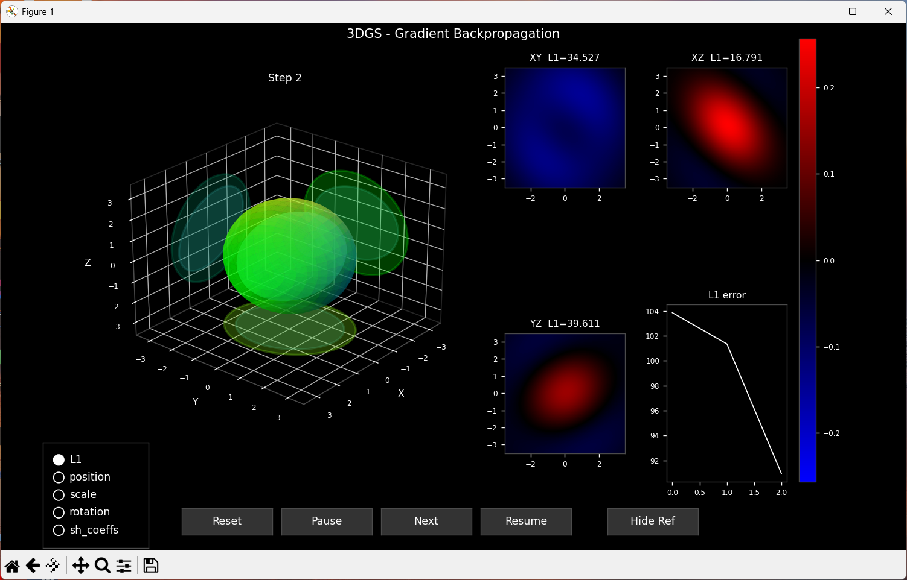
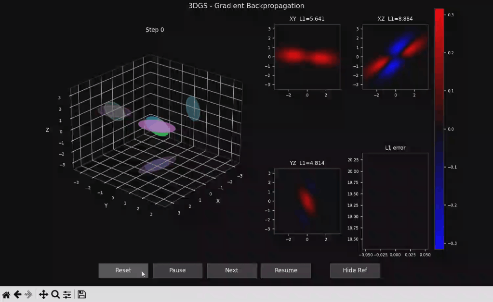

# Gaussian Splats Gradient Flow

This project is a python implementation of the Gaussian Splats Optimization process, as described in [3D Gaussian Splatting for Real-Time Radiance Field Rendering](https://repo-sam.inria.fr/fungraph/3d-gaussian-splatting/). We previously wrote a [CUDA renderer](https://github.com/etienne-p/CUDAGaussianRenderer) and an [RTX raytracer](https://github.com/etienne-p/OptixGaussianRenderer) for Gaussian Splats. After having focused on Gaussian Splats **rendering**, we now move on to the **optimization** process, by which Gaussian Splats are evaluated iteratively based on a set of views.

## Goals & Assumptions

The purpose of this project is to help us develop an understanding of the process. It is educational in nature.  To make it simpler, we make a couple of assumptions:
 * We use 3 orthogonal orthographic views. So we do not need the Jacobian matrix of a perspective projection. Because the orthogrpahic projection is affine (linear). When evaluating Spherical Harmonics, the viewing direction is independent of the splat position.
 * We optimize one splat at a time, based on a random splat used as a reference. The rasterized image from which we derive the error (that is backwards propagated) results from the rasterization of this reference splat.
 * In 3DGS, the gradient for a splat is accumulated across all the pixels it influences. Since we have just one splat, we can skip this step and propagate the global error directly to the splat parameters. We need not worry about the contribution of the splat to the image nor its occlusion, nor do we have an opacity factor.
 * We only use the `L1` error term, and ignore the perceptual `D-SSIM` term used in the original implementation.

## Approach

We write our prototype in python without much concern for performance. We are primarily interested in readability. We break down the computation into a set of kernels. These kernels are used by operations, each of which has a `forward` and a corresponding `backward` method. (Gradients computations are unit tested using finite differences.)

The whole process involves two passes, the forward and the backward pass. During the forward pass, we push operations onto a stack, in order, and invoke their `forward` method. During the backward pass, we pop these operations, executing them in reverse order, and invoke their `backward` method.

Tensors are stored and fetched from a context, which is simply a dictionary mapping string identifiers to scalars / tensors. We have chosen this approach as it structures the code in a way that reflects the fundamental principles of the learning process. Our architecture reflects that of ML frameworks (like PyTorch), albeit at a much simplifed level.

Parameters are updated using the Adam optimizer, as in the original 3DGS paper. During the optimization process, similarly to the original 3DGS paper, we gradually introduce higher degrees of Spherical Harmonics (0, 1, 2).

## Visualization

On the left panel, we display the 3D scene and the 3 orthogonal projections used for optimization. On the right panel, we visualize the rasterized error or attribution (either for position, scale, rotation or spherical harmonics) for each view, and plot the integrated error over the optimization process.

_The attribution (for each parameter group) is a visualization of the spatial attribution of the gradient. The contribution of the error at a pixel to the gradient update. We can think of it as the sensitivity of the gradient to the error at each pixel. To compute attribution, one runs the backwards pass on a per pixel basis instead of aggregating error over the pixels covered by the splat._

We have a toolbar to reset, pause, move on to the next frame, and resume the animation. We also have a toggle to display the reference splat.

_Note: gif encoding does introduce some artefacts._

